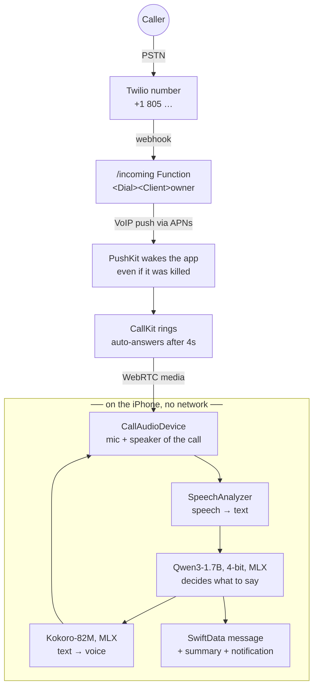

<div align="center">

# Assistant

### Your iPhone answers your calls, and the AI runs entirely on the phone.

A private AI receptionist for iOS. When you can't pick up, it answers, has a real conversation,
takes the message, and hands you a summary. The language model, speech recognition and voice
all run on the iPhone. No cloud LLM, no per-minute AI bill, and nobody else hears your calls.


&nbsp;&nbsp;
&nbsp;&nbsp;


</div>

---

## Why

Cloud voice agents stream every word of your calls to someone else's servers and bill you by the minute.
A 2024 iPhone already carries a capable language model, a speech recognizer and a natural voice. **Assistant**
puts them together into an agent that picks up for you:

- 🔒 **Private by design.** Transcription, reasoning and speech all happen on the phone. The call itself
  travels over the phone network (Twilio), but nothing that *understands* the call runs anywhere else.
- 💸 **No AI running cost.** The model is free once downloaded. There's no token or per-minute metering.
- 🧠 **Knows who it works for.** Give it your profile and it can tell a recruiter what you do in one sentence.
  It never shares your address, schedule or whereabouts.
- 📝 **Hands you the message, not a voicemail.** Name, reason, callback and urgency, summarized and pushed as a notification.

## What it does

| | |
|---|---|
| 🎙️ **Voice orb** | Tap the orb and talk. It breathes with your voice, swirls while thinking, and glows when it speaks. |
| 🙋 **Your own assistant** | **My assistant** mode: talk to it like a voice chat. It knows who you are, the date, and every message it took ("who called today?"). **Test a call** mode practises the receptionist flow. |
| ✅ **Guided setup** | First launch walks you through the mic permission, speech model and assistant model downloads (with progress), then straight into talking. |
| ☎️ **Answers real calls** | Your Twilio number rings the iPhone through CallKit. Tap Answer and the agent takes the call. |
| ⚡ **Streams its replies** | Speaks sentence by sentence as the model writes, so it doesn't wait for the whole answer. |
| 📬 **Messages** | Every call is saved with a transcript and an AI summary. Urgent calls are flagged, and callback is one tap. |
| 💬 **Chat** | Type to the same on-device model. |
| 🪵 **Logs** | Every step (model load, speech, each turn, time to first reply) is viewable and shareable in Settings. |
| ⚙️ **Model & voice settings** | Download, re-download or delete the model, see what's on the phone, and pick or preview the voice. |
| 🧪 **Fine-tuning** | Train your own version on a Mac with MLX-LM and swap it in. |

## Architecture

The number you give out lives in Twilio. The intelligence lives in your pocket. Everything below the dotted
line runs on the iPhone, offline, with no API key and no per-token cost.



### The call path, step by step

1. **Someone dials your number.** Twilio receives it and asks its webhook what to do. The webhook is a Twilio
   Function that returns nine lines of TwiML: `<Dial><Client>owner</Client></Dial>`. "owner" is your iPhone.
2. **Twilio sends a VoIP push** through Apple's push service, signed with a VoIP certificate for the app's bundle
   ID. This is the only way to wake an iOS app that isn't running — and it works even if the app was swiped away.
3. **PushKit hands it to CallKit**, which rings the phone like a real call, lock screen and all. iOS requires the
   app to report a call for *every* VoIP push, so there is no silent wake-up here by design.
4. **The app answers itself** after a few seconds of ringing (`CXAnswerCallAction`), unless you grab it first.
   Those seconds are deliberate: it's your phone, and you get first refusal.
5. **Audio connects over WebRTC.** `CallAudioDevice` is the bridge — Twilio hands it the caller's microphone
   frames and takes back whatever the assistant says.
6. **From here nothing leaves the phone.** The loop below runs until the message is taken.

### The loop on the device

```
caller speaks → SpeechAnalyzer → Qwen3 → Kokoro → caller hears it
                     ▲                                    │
                     └──────────── repeat ────────────────┘
```

| Stage | What runs | Where |
|---|---|---|
| Hearing | Apple `SpeechAnalyzer`, `DictationTranscriber` fallback | on-device, Apple's models |
| Turn-taking | silence timer, 1.3–2.8 s depending on how the sentence ends | on-device |
| Thinking | Qwen3-1.7B 4-bit via MLX Swift, streaming | on-device, Metal (CPU when backgrounded) |
| Speaking | Kokoro-82M via MLX, Apple voices as fallback | on-device |
| Afterwards | SwiftData record, Qwen-written summary, local notification | on-device |

**Turn-taking** is the part that decides whether it feels human. The app doesn't cut in the moment you stop
making noise: it waits longer when a sentence ends on a word that implies more is coming ("and", "but", "my
number is"), and less when it ends cleanly. Replies are spoken as one continuous take rather than sentence
fragments, because chopped playback is what makes assistants sound robotic.

**Thinking is streamed.** The model starts producing words before it has finished the sentence, so the first
audio begins while the rest is still being generated. A reply lands in about a second or two on an A17/M-class
chip — the beat a person takes before answering, not a machine hanging.

**Repeats are caught before they're spoken.** If a reply opens with the same sentence as an earlier one, it's
discarded, the conversation is rebuilt without it, and the model is nudged forward. That one guard cut repeated
replies from 15.6% to 2.1%.

### What's local and what isn't

| | Needs the network |
|---|---|
| Speech recognition, the model, the voice, the transcript, the summary | **No** — ever |
| The call arriving at all (push + media) | **Yes** — Wi-Fi or cellular data |

The brain is offline; the phone line isn't. The model runs on your phone, so no audio, transcript or message is
sent to any AI service — but a call still has to travel from Twilio's data centre to your pocket, and iOS gives
apps no way to answer your carrier's line directly.

### Why these pieces

- **Qwen3-1.7B, 4-bit** — about 1 GB. Big enough to hold a conversation and follow rules about what not to say;
  small enough to answer in a second on a phone while sharing memory with speech and audio.
- **MLX** — Apple's array framework. Unified memory means the weights aren't copied to the GPU, which is what
  makes a 1 GB model practical on a device that's also recording and playing audio.
- **Kokoro-82M** — a 327 MB neural voice engine plus 0.5 MB per voice, downloaded on demand. Apple's built-in
  voices are the fallback while it downloads.
- **CallKit + PushKit** — the only sanctioned path for an app to be in a phone call on iOS.
- **Twilio Functions** — the webhook and the token endpoint are ~40 lines of JavaScript, so there's no server to
  run, patch or pay for.

### Where it can fail

Honest list, since these are the things that actually bite:

- **No data on the phone** → the push never arrives and the caller gets voicemail after 25 seconds.
- **Background GPU** — iOS blocks Metal work in the background, so the model switches to CPU there. Slower, but
  it keeps answering.
- **Model not downloaded yet** → the assistant still greets the caller (the greeting needs neither model nor
  recognizer) while the download finishes.
- **Voice engine not downloaded** → Apple's voice is used, which sounds noticeably more synthetic.
- **The APNs environment must match** the certificate: TestFlight builds are production, local debug builds are
  sandbox. A mismatch means the phone never rings, silently.

## Quick start

**Requirements:** a Mac with Xcode 26, [XcodeGen](https://github.com/yonaskolb/XcodeGen), and an iPhone on iOS 26.

```bash
git clone https://github.com/techadnank9/Assistant.git
cd Assistant
xcodegen generate
open Assistant.xcodeproj
```

1. Pick your team under **Signing & Capabilities**. The app asks for more memory, which needs a paid developer account.
2. Run it on your iPhone. The first launch downloads the model once (about 1 GB on Wi-Fi).
3. The setup screen asks for the microphone and downloads what's needed. Tap **Start talking**.
4. Switch to **Test a call** and pretend you're calling. The message shows up under **Messages**.

> **Simulator:** the whole app runs in the simulator, with a scripted model and a scripted caller standing in, because MLX and
> Apple's speech models can't run there. It's handy for UI work. The real model needs a device.

<details>
<summary><b>Answer real phone calls (Twilio)</b></summary>

1. Put `ACCOUNT_SID` and `AUTH_TOKEN` from the Twilio console into `twilio/.env`.
2. Create a **VoIP Services Certificate** for your bundle ID at developer.apple.com, using the request generated by
   `twilio/voip-cert.sh csr`. Then import it with `twilio/voip-cert.sh import ~/Downloads/voip_services.cer`.
3. `cd twilio && npm install && npm run setup`. This creates the API key and push credential, deploys the token, incoming
   and voicemail Functions, and points your number at the app. Add `-- --buy` to buy a number (this costs money).
4. `npm run setup` writes `Assistant/Resources/TwilioConfig.plist` (gitignored), so the build comes ready and
   there's nothing to type. Open the app once and **Settings → Phone number** shows *Registered*. You can still
   paste a URL and secret there by hand to point a build at a different account.

The assistant answers on its own after a few seconds of ringing; turn that off in Settings if you'd rather tap.
If nobody and nothing answers within 25 seconds, the caller gets voicemail.
</details>

<details>
<summary><b>Tell it about yourself</b></summary>

Put a few lines about your work in `Assistant/Resources/OwnerProfile.txt`, or type them in Settings. The assistant
uses them to answer "what does Adnan do?" in one sentence, then takes the message. The file is gitignored.
</details>

## Fine-tuning your own model

Everything in `finetune/` runs on an Apple silicon Mac:

- **Teacher and student:** Qwen3-8B acts out realistic calls (recruiters, doctor's offices, delivery drivers, spam,
  urgent family calls, callers fishing for personal info) as both caller and ideal assistant. Qwen3-1.7B learns from it with LoRA.
- **Real data:** a 10% slice of human phone-assistant dialogs from Google's
  [Taskmaster-1](https://github.com/google-research-datasets/Taskmaster) (CC BY 4.0) keeps replies short and spoken.
- **Quality gates:** calls that loop, ramble or never end are dropped. The best checkpoint is picked by validation loss.
- **Honest evaluation:** held-out callers are scored by the teacher on capture, brevity, naturalness, safety and ending.
  A tuned model ships only if it beats the base.

```bash
cd finetune && ./run_all.sh    # real data → practice calls → LoRA → fuse → 4-bit → before/after report
```

| Round | Training data | Score vs base (/10) | Shipped |
|---|---|---|---|
| 2 | 317 practice calls + 320 Taskmaster | 9.06 vs **9.19** (wordier, ended 81% of calls) | no |
| 4 | 144 generated caller personas, SFT then DPO (QLoRA) against the student's worst replies | SFT 9.00, SFT+DPO 9.34 vs **9.75** (both repeated themselves more) | no |

What actually fixed the base model's weak spot (asking the same question when a caller repeats or refuses)
was a prompt rule plus a repeat guard in the app: repeated replies dropped from 15.6% to **2.1%** and calls
ended properly went from 91% to **97%** on 32 held-out callers. DPO did its job (it preferred the better reply
82% of the time on unseen pairs), but the fine-tuning before it hurt more than DPO recovered.

| Round | Training data | Result vs base (same prompt and repeat guard) | Shipped |
|---|---|---|---|
| 5 | DPO directly on the base model, 118 pairs of teacher reply vs its own worst reply | 9.75 vs 9.62 /10, **0%** vs 2.1% repeats, but ended 91% vs 97% of calls | as an opt-in model ([adnank9/qwen3-1.7b-phone-assistant-dpo-experimental-4bit](https://huggingface.co/adnank9/qwen3-1.7b-phone-assistant-dpo-experimental-4bit)) |

## Project layout

```
Assistant/
  LLM/        LLMEngine: one actor owning the model and every conversation (CPU fallback in background)
  Voice/      VoiceAgent loop, Listener (speech → text), Speaker (text → speech), VoiceOrb, audio I/O
  Calls/      PushKit + CallKit + Twilio, CallAudioDevice bridging call audio to the agent
  Messages/   SwiftData store, Qwen summaries, notifications
  Chat/ Settings/ Support/
twilio/       Functions: /token, /incoming, /voicemail, plus the one-shot setup script
finetune/     dataset generation, LoRA training, evaluation
```

## Roadmap

- [x] On-device Qwen3 chat
- [x] Voice loop with streaming speech and a live orb
- [x] Real calls through Twilio, CallKit and PushKit
- [x] Messages with summaries and notifications
- [x] Fine-tuning pipeline with before/after evaluation
- [ ] A fine-tuned model that beats the base, shipped as the default
- [ ] Barge-in, so callers can interrupt the assistant mid-sentence
- [ ] More languages
- [ ] Call screening: let VIPs ring through, send spam straight to the assistant
- [ ] Faster answering from the lock screen (background GPU when iOS allows it)

## FAQ

**Does any audio leave my phone?** The call itself travels over the phone network through Twilio, like any call.
Transcription, the language model, the voice and the summary all run on the iPhone.

**Which iPhones work?** Any iPhone on iOS 26 with enough free memory for a roughly 1 GB model. Newer Pro models run it
fastest. For older devices, Settings has a lighter 0.6B model.

**Why is it slower when I answer from the lock screen?** iOS doesn't let background apps use the GPU, so the model
runs on the CPU until you open the app.

**Can I use a different model?** Yes. Settings → Model takes any MLX model repo from Hugging Face.

## Contributing

Issues and PRs are welcome. See [CLAUDE.md](CLAUDE.md) for build flags, simulator notes and the architecture.
The call prompt lives in both `Assistant/LLM/ModelChoice.swift` and `finetune/common.py`. Keep them in sync.

## Credits

Built on [MLX Swift](https://github.com/ml-explore/mlx-swift) and [mlx-swift-lm](https://github.com/ml-explore/mlx-swift-lm),
[Qwen3](https://huggingface.co/Qwen), [Twilio Voice iOS](https://github.com/twilio/twilio-voice-ios), Apple's Speech and
AVFoundation, and Google's [Taskmaster](https://github.com/google-research-datasets/Taskmaster) dataset.

## License

[MIT](LICENSE) © Mohammed Adnan
