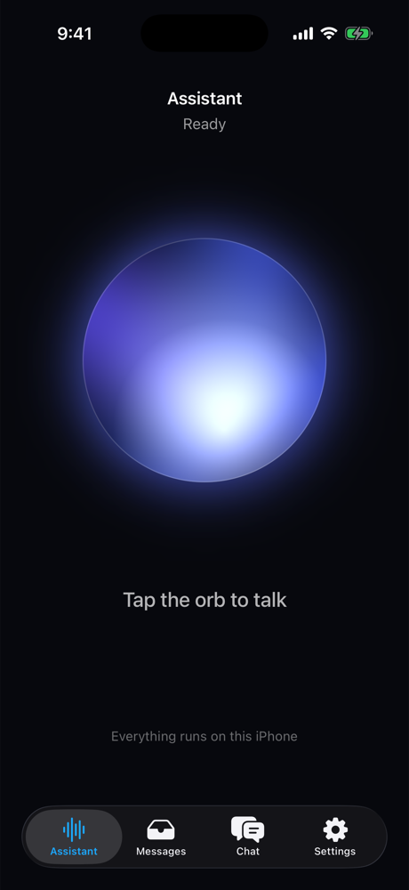
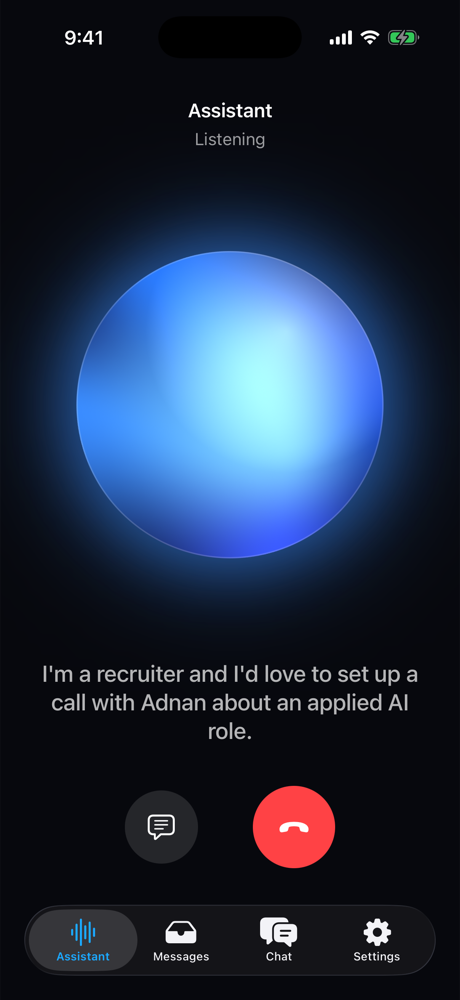
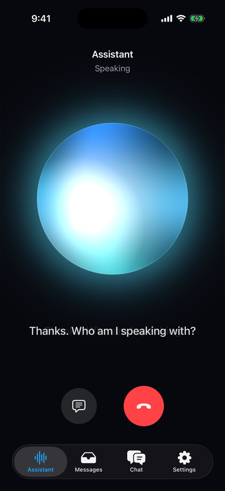
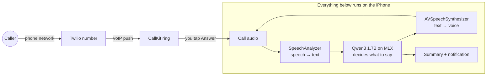

<div align="center">

# Assistant

### Your iPhone answers your calls, and the AI runs entirely on the phone.

A private AI receptionist for iOS. When you can't pick up, it answers, has a real conversation,
takes the message, and hands you a summary. The language model, speech recognition and voice
all run on the iPhone. No cloud LLM, no per-minute AI bill, and nobody else hears your calls.


&nbsp;&nbsp;
&nbsp;&nbsp;


</div>

---

## Why

Cloud voice agents stream every word of your calls to someone else's servers and bill you by the minute.
A 2024 iPhone already carries a capable language model, a speech recognizer and a natural voice. **Assistant**
puts them together into an agent that picks up for you:

- 🔒 **Private by design.** Transcription, reasoning and speech all happen on the phone. The call itself
  travels over the phone network (Twilio), but nothing that *understands* the call runs anywhere else.
- 💸 **No AI running cost.** The model is free once downloaded. There's no token or per-minute metering.
- 🧠 **Knows who it works for.** Give it your profile and it can tell a recruiter what you do in one sentence.
  It never shares your address, schedule or whereabouts.
- 📝 **Hands you the message, not a voicemail.** Name, reason, callback and urgency, summarized and pushed as a notification.

## What it does

| | |
|---|---|
| 🎙️ **Voice orb** | Tap the orb and talk. It breathes with your voice, swirls while thinking, and glows when it speaks. |
| 🙋 **Your own assistant** | **My assistant** mode: talk to it like a voice chat. It knows who you are, the date, and every message it took ("who called today?"). **Test a call** mode practises the receptionist flow. |
| ✅ **Guided setup** | First launch walks you through the mic permission, speech model and assistant model downloads (with progress), then straight into talking. |
| ☎️ **Answers real calls** | Your Twilio number rings the iPhone through CallKit. Tap Answer and the agent takes the call. |
| ⚡ **Streams its replies** | Speaks sentence by sentence as the model writes, so it doesn't wait for the whole answer. |
| 📬 **Messages** | Every call is saved with a transcript and an AI summary. Urgent calls are flagged, and callback is one tap. |
| 💬 **Chat** | Type to the same on-device model. |
| 🪵 **Logs** | Every step (model load, speech, each turn, time to first reply) is viewable and shareable in Settings. |
| ⚙️ **Model & voice settings** | Download, re-download or delete the model, see what's on the phone, and pick or preview the voice. |
| 🧪 **Fine-tuning** | Train your own version on a Mac with MLX-LM and swap it in. |

## How it works



1. **Listen.** On-device `SpeechAnalyzer` transcribes the caller. The turn ends when the words stop changing.
2. **Think.** Qwen3-1.7B (4-bit, MLX) replies in one or two spoken sentences, asking for one missing detail at a time.
3. **Speak.** Each finished sentence goes straight to speech and into the call.
4. **Wrap up.** When it has the message, it reads it back, says goodbye and hangs up. Then it summarizes the call and notifies you.

## Quick start

**Requirements:** a Mac with Xcode 26, [XcodeGen](https://github.com/yonaskolb/XcodeGen), and an iPhone on iOS 26.

```bash
git clone https://github.com/techadnank9/Assistant.git
cd Assistant
xcodegen generate
open Assistant.xcodeproj
```

1. Pick your team under **Signing & Capabilities**. The app asks for more memory, which needs a paid developer account.
2. Run it on your iPhone. The first launch downloads the model once (about 1 GB on Wi-Fi).
3. The setup screen asks for the microphone and downloads what's needed. Tap **Start talking**.
4. Switch to **Test a call** and pretend you're calling. The message shows up under **Messages**.

> **Simulator:** the whole app runs in the simulator, with a scripted model and a scripted caller standing in, because MLX and
> Apple's speech models can't run there. It's handy for UI work. The real model needs a device.

<details>
<summary><b>Answer real phone calls (Twilio)</b></summary>

1. Put `ACCOUNT_SID` and `AUTH_TOKEN` from the Twilio console into `twilio/.env`.
2. Create a **VoIP Services Certificate** for your bundle ID at developer.apple.com, using the request generated by
   `twilio/voip-cert.sh csr`. Then import it with `twilio/voip-cert.sh import ~/Downloads/voip_services.cer`.
3. `cd twilio && npm install && npm run setup`. This creates the API key and push credential, deploys the token, incoming
   and voicemail Functions, and points your number at the app. Add `-- --buy` to buy a number (this costs money).
4. In the app, open **Settings → Phone number**, paste the printed URL and secret, and tap **Register for calls**.

If nobody answers within 25 seconds, the caller gets voicemail.
</details>

<details>
<summary><b>Tell it about yourself</b></summary>

Put a few lines about your work in `Assistant/Resources/OwnerProfile.txt`, or type them in Settings. The assistant
uses them to answer "what does Adnan do?" in one sentence, then takes the message. The file is gitignored.
</details>

## Fine-tuning your own model

Everything in `finetune/` runs on an Apple silicon Mac:

- **Teacher and student:** Qwen3-8B acts out realistic calls (recruiters, doctor's offices, delivery drivers, spam,
  urgent family calls, callers fishing for personal info) as both caller and ideal assistant. Qwen3-1.7B learns from it with LoRA.
- **Real data:** a 10% slice of human phone-assistant dialogs from Google's
  [Taskmaster-1](https://github.com/google-research-datasets/Taskmaster) (CC BY 4.0) keeps replies short and spoken.
- **Quality gates:** calls that loop, ramble or never end are dropped. The best checkpoint is picked by validation loss.
- **Honest evaluation:** held-out callers are scored by the teacher on capture, brevity, naturalness, safety and ending.
  A tuned model ships only if it beats the base.

```bash
cd finetune && ./run_all.sh    # real data → practice calls → LoRA → fuse → 4-bit → before/after report
```

| Round | Training data | Score vs base (/10) | Shipped |
|---|---|---|---|
| 2 | 317 practice calls + 320 Taskmaster | 9.06 vs **9.19** (wordier, ended 81% of calls) | no |
| 4 | 144 generated caller personas, SFT then DPO (QLoRA) against the student's worst replies | SFT 9.00, SFT+DPO 9.34 vs **9.75** (both repeated themselves more) | no |

What actually fixed the base model's weak spot (asking the same question when a caller repeats or refuses)
was a prompt rule plus a repeat guard in the app: repeated replies dropped from 15.6% to **2.1%** and calls
ended properly went from 91% to **97%** on 32 held-out callers. DPO did its job (it preferred the better reply
82% of the time on unseen pairs), but the fine-tuning before it hurt more than DPO recovered; the next
attempt is DPO directly on the base model.

## Project layout

```
Assistant/
  LLM/        LLMEngine: one actor owning the model and every conversation (CPU fallback in background)
  Voice/      VoiceAgent loop, Listener (speech → text), Speaker (text → speech), VoiceOrb, audio I/O
  Calls/      PushKit + CallKit + Twilio, CallAudioDevice bridging call audio to the agent
  Messages/   SwiftData store, Qwen summaries, notifications
  Chat/ Settings/ Support/
twilio/       Functions: /token, /incoming, /voicemail, plus the one-shot setup script
finetune/     dataset generation, LoRA training, evaluation
```

## Roadmap

- [x] On-device Qwen3 chat
- [x] Voice loop with streaming speech and a live orb
- [x] Real calls through Twilio, CallKit and PushKit
- [x] Messages with summaries and notifications
- [x] Fine-tuning pipeline with before/after evaluation
- [ ] A fine-tuned model that beats the base, shipped as the default
- [ ] Barge-in, so callers can interrupt the assistant mid-sentence
- [ ] More languages
- [ ] Call screening: let VIPs ring through, send spam straight to the assistant
- [ ] Faster answering from the lock screen (background GPU when iOS allows it)

## FAQ

**Does any audio leave my phone?** The call itself travels over the phone network through Twilio, like any call.
Transcription, the language model, the voice and the summary all run on the iPhone.

**Which iPhones work?** Any iPhone on iOS 26 with enough free memory for a roughly 1 GB model. Newer Pro models run it
fastest. For older devices, Settings has a lighter 0.6B model.

**Why is it slower when I answer from the lock screen?** iOS doesn't let background apps use the GPU, so the model
runs on the CPU until you open the app.

**Can I use a different model?** Yes. Settings → Model takes any MLX model repo from Hugging Face.

## Contributing

Issues and PRs are welcome. See [CLAUDE.md](CLAUDE.md) for build flags, simulator notes and the architecture.
The call prompt lives in both `Assistant/LLM/ModelChoice.swift` and `finetune/common.py`. Keep them in sync.

## Credits

Built on [MLX Swift](https://github.com/ml-explore/mlx-swift) and [mlx-swift-lm](https://github.com/ml-explore/mlx-swift-lm),
[Qwen3](https://huggingface.co/Qwen), [Twilio Voice iOS](https://github.com/twilio/twilio-voice-ios), Apple's Speech and
AVFoundation, and Google's [Taskmaster](https://github.com/google-research-datasets/Taskmaster) dataset.

## License

[MIT](LICENSE) © Mohammed Adnan
